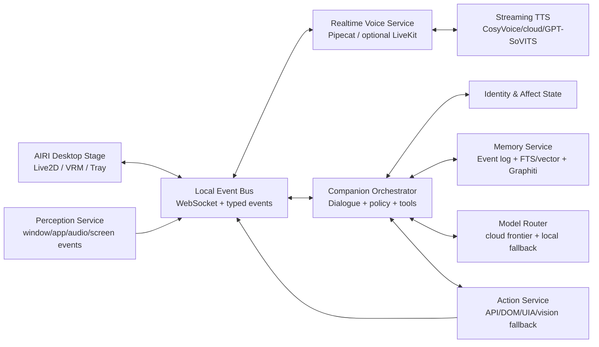

# 二次元虚拟伴侣：2026 最佳实践研究与实现计划

> 研究截止：2026-07-28（Asia/Shanghai）
> 目标设备：Windows 11 x64，Intel i9-12900H，32 GB RAM，RTX 3060 Laptop 6 GB VRAM
> 产品目标：接近《命运石之门》Amadeus 或现代 AI VTuber 的“持续存在感”，而不是一个带立绘的聊天框。

## 1. 结论先行

当前最优的工程路线不是寻找一个包办全部能力的仓库，而是构建一个**本地优先、云端增强、模块可替换、以事件日志为事实源**的虚拟生命运行时：

1. 以 [Project AIRI](https://github.com/moeru-ai/airi) 的桌面舞台、角色卡、Live2D/VRM 和桌宠体验作为角色外壳与快速原型。
2. 以 [Pipecat](https://github.com/pipecat-ai/pipecat) 作为单用户实时语音编排层；以后需要手机、远程房间或多人连接时，增加 [LiveKit Agents](https://github.com/livekit/agents) 传输适配器。
3. 以流式 ASR → LLM → 流式情感 TTS 作为当前生产链路，同时预留原生 speech-to-speech 接口，持续评估 [Moshi](https://github.com/kyutai-labs/moshi) 等全双工模型。
4. 以追加式事件日志保存所有经历；SQLite/FTS/向量索引负责快速检索，[Graphiti](https://github.com/getzep/graphiti) 负责时间化人物关系和事件图。任何摘要、向量和图谱都必须能从原始事件重建。
5. 由确定性的主动行为策略控制“何时说话”，LLM 只负责提出候选内容，不得自行决定无限观察、打扰或操作电脑。
6. 电脑操作优先使用 Windows UI Automation、浏览器 DOM 和明确 API；视觉点击只作为后备，并通过 [UFO](https://github.com/microsoft/UFO)、[browser-use](https://github.com/browser-use/browser-use) 或类似适配器运行在权限沙箱中。
7. 将人格、情绪、关系和目标表示为缓慢变化的结构化状态，不允许每轮对话重新“即兴生成一个人格”。

这套路线的核心创新是：**把“活着感”定义为四种连续性——对话节奏、记忆因果、情绪状态和环境行为的连续性——并分别实现和评测。**

## 2. 什么才算完成

最终产品应满足以下可验证标准，而不是只看 Demo 是否好看：

| 维度 | 可观察行为 | 首个正式版本验收线 |
|---|---|---|
| 实时性 | 用户说完后自然接话，可打断，能处理“嗯、等等”等插话 | 首音频 p50 < 900 ms，p95 < 1.8 s；打断停止 p95 < 300 ms |
| 身份连续性 | 跨天仍保持称呼、价值观、语气和关系边界 | 200 条人格测试矛盾率 < 2% |
| 记忆连续性 | 记得事件时间、人物关系、更新后的偏好，也会承认不知道 | LongMemEval 风格集合准确率 > 80%，错误自信率 < 5% |
| 情绪连续性 | 情绪有惯性、原因和恢复过程，声音/表情与内容一致 | 状态跳变违规 < 2%；人工情绪适切性均分 > 4/5 |
| 存在感 | 会在合适时机主动回应屏幕事件、计划和纪念日 | 主动消息接受率 > 70%；“打扰”反馈 < 10% |
| 行动安全 | 能完成有限电脑任务，但不会越权、误操作或静默外发 | 高风险操作确认率 100%；未授权外发/删除为 0 |
| 可恢复性 | 更新模型或索引不会让“她失忆” | 从事件日志重建全部派生记忆通过一致性校验 |

## 3. GitHub 轮子选择

Star、提交和 Release 数据为调研日快照，只用于判断社区与维护健康度，不等于代码质量证明。

### 3.1 核心采用

| 层 | 项目与快照 | 采用方式 | 关键理由与限制 |
|---|---|---|---|
| 桌面角色壳 | [AIRI](https://github.com/moeru-ai/airi)，约 43.9k Star，MIT，2026-07-27 有提交，[v0.11.3](https://github.com/moeru-ai/airi/releases/tag/v0.11.3) | 首版 UI/角色舞台和协议参考；尽量通过适配层集成，不把领域逻辑写死在其 UI 内 | 最接近“cyber living”；仍在快速开发，长期记忆和主动屏幕感知未完全成熟 |
| 实时语音编排 | [Pipecat](https://github.com/pipecat-ai/pipecat)，约 13.7k Star，BSD-2-Clause，2026-07-27 有提交，[v1.6.0](https://github.com/pipecat-ai/pipecat/releases/tag/v1.6.0) | 语音管线、VAD、打断、上下文和供应商适配 | 模块化且适合本地单用户；必须固定版本并做中断/队列回归测试 |
| 多设备传输（可选） | [LiveKit Agents](https://github.com/livekit/agents)，约 11.5k Star，Apache-2.0，[1.6.7](https://github.com/livekit/agents/releases/tag/livekit-agents%401.6.7) | 第二阶段作为 WebRTC/手机/远程房间传输层 | 维护响应快，但对单机 MVP 偏重，不作为首版硬依赖 |
| 本地 ASR/VAD | [sherpa-onnx](https://github.com/k2-fsa/sherpa-onnx)，约 13.8k Star，Apache-2.0 | 离线、低资源备用；中文可同时评估 FunASR/SenseVoice | Windows CUDA 依赖需严格锁版；CPU 路径更易部署 |
| 高准确 ASR | [faster-whisper](https://github.com/SYSTRAN/faster-whisper)，约 24.5k Star，MIT，[v1.2.1](https://github.com/SYSTRAN/faster-whisper/releases/tag/v1.2.1) | 非实时转写、记忆归档校正、较长音频 | 比流式轻量 ASR 延迟高，不单独承担所有实时输入 |
| 本地 TTS | [CosyVoice](https://github.com/QwenAudio/CosyVoice)，约 22.4k Star，Apache-2.0 | 优先评估流式、情绪、语速和音量控制；显存不足时部署到独立机器或改云端 | 宣称双向流式首包约 150 ms；模型运行需求必须实机基准 |
| 角色音色实验 | [GPT-SoVITS](https://github.com/RVC-Boss/GPT-SoVITS)，约 60.1k Star，MIT | 获得合法声音数据后做角色音色；作为可选 TTS provider | 易做少样本音色，但服务启动、模型版本和延迟坑较多 |
| 本地 LLM 运行时 | [llama.cpp](https://github.com/ggml-org/llama.cpp)，约 121k Star，MIT；[Ollama](https://github.com/ollama/ollama)，约 177k Star，MIT | llama.cpp 作为可控部署底座；Ollama 用于开发便利和模型管理 | 6 GB VRAM 只适合量化小模型/部分卸载，不能期待与前沿云模型等价 |
| 时间化记忆 | [Graphiti](https://github.com/getzep/graphiti)，约 29.2k Star，Apache-2.0，[v0.29.2](https://github.com/getzep/graphiti/releases/tag/v0.29.2) | 派生的时间知识图谱；保存事实有效期、关系变化与来源引用 | 不是事实源；Windows Docker/FalkorDB 曾有环境问题，需锁定数据库版本 |
| 轻量记忆候选 | [Mem0](https://github.com/mem0ai/mem0)，约 61.8k Star，Apache-2.0，[v2.0.14](https://github.com/mem0ai/mem0/releases/tag/v2.0.14) | 作为 A/B 候选或偏好事实提取器，不直接成为唯一记忆层 | 活跃但多后端差异大；检索截断、过滤和评分语义必须回归测试 |
| Windows 行动 | [UFO](https://github.com/microsoft/UFO)，约 9.3k Star，MIT，[3.0.7](https://github.com/microsoft/UFO/releases/tag/3.0.7) | 隔离为受控 Action Service；只开放白名单动作 | GUI agent 仍不可靠，不能让它拥有默认无限权限 |
| 浏览器行动 | [browser-use](https://github.com/browser-use/browser-use)，约 107k Star，MIT，[0.13.7](https://github.com/browser-use/browser-use/releases/tag/0.13.7) | 浏览器专用工具服务，优先 DOM 语义操作 | 页面变化、登录态和提示注入仍需防护 |
| VRM 渲染 | [three-vrm](https://github.com/pixiv/three-vrm)，约 2k Star，MIT，[v3.5.5](https://github.com/pixiv/three-vrm/releases/tag/v3.5.5) | 3D/VRM 开放渲染路径 | Star 不及核心项目，但属于 VRM 专项成熟基础库 |

### 3.2 只借鉴、不作为首版核心

| 项目 | 借鉴内容 | 不直接采用的原因 |
|---|---|---|
| [Open-LLM-VTuber](https://github.com/Open-LLM-VTuber/Open-LLM-VTuber) | 桌宠模式、无耳机打断、视觉输入、角色/TTS provider 配置 | v1 进入维护期且 v2 在规划重写；Release 较旧，作为兼容性和实现参考更合适 |
| [Moshi](https://github.com/kyutai-labs/moshi) | 双音频流、永远监听、重叠说话、Inner Monologue、约 200 ms 实验结果 | 7B 语音模型在 L4 上的结果不能迁移到 6 GB RTX 3060；首版硬件不可行 |
| [Ultravox](https://github.com/fixie-ai/ultravox) | 低延迟语音理解与原生音频输入 | 仍需独立 TTS，近期活跃度不及主编排框架；作为以后 provider |
| [Letta](https://github.com/letta-ai/letta) | 分层上下文、agent 自主管理记忆、MemGPT 思路 | 为简单陪伴对话引入完整 stateful-agent 平台过重；工具调用会增延迟和不确定性 |
| [HippoRAG](https://github.com/OSU-NLP-Group/HippoRAG) | 图检索、PPR、多跳关联 | 面向文档知识整合；伴侣记忆还需要时间有效性、用户修正和隐私删除语义 |
| [OmniParser](https://github.com/microsoft/OmniParser) | 屏幕元素解析和视觉 GUI grounding | 视觉路径昂贵且不稳定；只用于 UI Automation/DOM 都失败的后备路径 |
| [SillyTavern](https://github.com/SillyTavern/SillyTavern) | 角色卡、世界书、提示词编辑和对话分支 UX | AGPL-3.0 且核心定位仍是 LLM 前端，不是实时具身伴侣运行时 |

### 3.3 必读 Issues：真实踩坑证据

- AIRI Windows 安装器曾无响应，最新构建解决：[AIRI #1077](https://github.com/moeru-ai/airi/issues/1077)。结论：只发稳定版，安装包加 SHA-256 与启动自检。
- AIRI Live2D ZIP 的可选 `null` 字段曾导致载入失败：[AIRI #1933](https://github.com/moeru-ai/airi/issues/1933)。结论：导入前验证模型清单并提供诊断报告。
- AIRI VAD 触发录音曾截掉首字：[AIRI #2092](https://github.com/moeru-ai/airi/issues/2092)。结论：必须有 300-500 ms pre-roll ring buffer。
- AIRI 桌面版仍有自定义 Live2D 表情问题：[AIRI #2048](https://github.com/moeru-ai/airi/issues/2048)。结论：网页版和桌面版分别做模型兼容测试。
- Pipecat 曾因队列竞态丢失最后一个词：[Pipecat #5119](https://github.com/pipecat-ai/pipecat/issues/5119)。结论：上下文提交以音频确认事件为准，不以文本生成结束为准。
- Pipecat 曾因 STT 未 finalize 每轮额外等待约 1.4 秒：[Pipecat #5018](https://github.com/pipecat-ai/pipecat/issues/5018)。结论：对每个 provider 建 TTFT/终止信号契约测试。
- LiveKit 曾在工具回复后重复播报：[LiveKit #6411](https://github.com/livekit/agents/issues/6411)。结论：每轮输出需唯一 `turn_id` 和幂等音频提交。
- Graphiti Windows Docker Compose 曾错误插入宿主机 PATH：[Graphiti #1623](https://github.com/getzep/graphiti/issues/1623)。结论：使用显式环境变量白名单与固定镜像。
- Mem0 rerank 曾只重排截断后的 topK，无法改善召回：[Mem0 #6575](https://github.com/mem0ai/mem0/issues/6575)。结论：先高召回候选，再 rerank；用基准而非默认参数裁决。
- Open-LLM-VTuber 的 sherpa-onnx CUDA 轮子要求 CUDA 11.x/cuDNN 8.x 和匹配 ONNX Runtime：[OLV #112](https://github.com/Open-LLM-VTuber/Open-LLM-VTuber/issues/112)。结论：本机 CUDA 13.3 驱动不代表旧 wheel 可直接运行，优先 CPU 或独立锁定环境。
- GPT-SoVITS “有文字无声音”常因 API 服务未完整启动：[OLV #286](https://github.com/Open-LLM-VTuber/Open-LLM-VTuber/issues/286)、[#314](https://github.com/Open-LLM-VTuber/Open-LLM-VTuber/issues/314)。结论：TTS provider 必须提供健康检查和测试音频。

## 4. 前沿实验和论文带来的可落地灵感

### 4.1 全双工不是“更快的 TTS”，而是不同的对话模型

[Moshi: a speech-text foundation model for real-time dialogue](https://arxiv.org/abs/2410.00037) 将用户和系统音频建模为并行流，同时生成时间对齐的“Inner Monologue”文本；论文报告理论 160 ms、实践约 200 ms 延迟。这证明自然对话需要：

- 系统说话时仍持续听用户；
- 支持重叠、插话、笑声和短反馈；
- 输出内容与实际说出的音频有时间对齐记录；
- 不把 VAD 判定的“完整轮次”当作唯一交互单位。

**现在落地：**仍使用级联模型，但管线必须持续双向运行；实现 echo cancellation、pre-roll、barge-in、短反馈识别和可取消 TTS。所有消息采用 `turn_id`、`audio_span` 和 `interrupted_at`，只把真正播放的部分写入共同对话历史。

**以后替换：**定义 `DuplexSpeechProvider` 接口，在 Moshi 类模型能在目标硬件达到质量/延迟门槛时替换 ASR+LLM+TTS，而不改变记忆、人格和桌面协议。

### 4.2 长期记忆必须同时处理时间、更新和“不知道”

[LongMemEval](https://arxiv.org/abs/2410.10813) 将长期记忆拆成信息提取、跨会话推理、时间推理、知识更新和拒答，并发现持续交互会让商用助手及长上下文模型准确率下降约 30%。它给出的有效工程策略包括：按会话分解、事实增强索引、时间感知查询扩展。

[LoCoMo](https://arxiv.org/abs/2402.17753) 使用最长 35 个 session、约 300 turns 的对话，说明长上下文和普通 RAG 仍明显落后于人类，尤其在时间和因果关系上。

[MemGPT](https://arxiv.org/abs/2310.08560) 证明分层上下文和主动换入/换出记忆能支持跨 session 对话；[HippoRAG](https://arxiv.org/abs/2405.14831) 则说明知识图谱与 Personalized PageRank 能改善多跳关联。

**综合落地：五层记忆。**

1. `event_log`：不可变原始经历，包含来源、时间、参与者、文本/音频引用和隐私级别。
2. `working_memory`：当前会话和最近活动，严格受 token/时间预算控制。
3. `semantic_facts`：用户偏好、身份和稳定事实，带 `valid_from`、`valid_to`、置信度、来源事件。
4. `episodic_memory`：共同经历与情绪意义，保留事件顺序和因果连接。
5. `reflections`：定期从多个事件归纳出的关系理解、未完成目标和行为倾向，必须引用证据事件。

用户纠正事实时不覆盖历史，而是关闭旧事实的有效期并追加新事实。删除请求必须级联删除原始事件及所有派生索引。

### 4.3 可信的“活着感”来自观察、反思和计划闭环

[Generative Agents](https://arxiv.org/abs/2304.03442) 的消融实验显示 observation、reflection、planning 都对行为可信度有关键贡献。可直接转化为伴侣的后台周期：

- 每次可见事件进入观察流；
- 重要性累计到阈值，或每天固定低负载时段生成一次反思；
- 反思产生可撤销的小目标，例如“晚上问一下用户今天的面试结果”；
- 行动前重新检查情境、权限和打扰成本，而不是盲目执行旧计划。

反思不等于无限自我提示。它必须是异步任务、有每日预算、能审计引用，并且不能直接修改人格核心或安全边界。

### 4.4 主动并不自动等于自然

[Comparing Perceptions of Static and Adaptive Proactive Speech Agents](https://arxiv.org/abs/2405.07528) 出现了反直觉结果：自适应主动代理被认为更不一致、更不合时宜，评分反而低于静态代理。[Towards Human-centered Proactive Conversational Agents](https://arxiv.org/abs/2404.12670) 强调 Intelligence、Adaptivity、Civility 三者要同时成立。

因此主动策略使用明确的效用函数，而不是“让 LLM 自己看着办”：“相关性 + 紧迫性 + 关系价值 - 打扰成本 - 近期主动次数 - 用户拒绝信号”。

首版规则：

- 默认安静；只监听由用户授权的低敏感事件，而不是连续截屏上传。
- 设 quiet hours、会议/全屏/输入密集状态、冷却时间和每日主动预算。
- 普通主动先用轻量动作（看向、表情、气泡），只有高价值事件才发声。
- 每次主动都允许一键反馈“喜欢 / 太频繁 / 现在别打扰”，用于更新策略。
- 不通过装病、吃醋、威胁消失或制造愧疚来提升互动率。

### 4.5 情绪应是有惯性的状态，而不是每句话贴标签

情感语音实验（例如 [EmoNews](https://arxiv.org/abs/2506.13894)）显示，按情境选择情绪语音显著提升情绪适切性；但突兀的离散情绪切换会降低自然度。实现上采用低维连续状态：

```text
valence        [-1, 1]   愉悦度
arousal        [ 0, 1]   唤醒度
trust          [ 0, 1]   信任
closeness      [ 0, 1]   亲密
energy         [ 0, 1]   当前精力
uncertainty    [ 0, 1]   对情境的把握
```

每个事件只产生有上限的 delta，状态按时间缓慢回归基线；TTS 情绪、Live2D 表情、动作幅度和措辞都读取同一状态快照。关系状态只能被可解释事件长期改变，不允许模型一句话把亲密度从陌生跳到恋人。

### 4.6 电脑代理仍远未达到可无监督托管的程度

[OSWorld](https://arxiv.org/abs/2404.07972) 的初始研究中，人类完成率超过 72%，最佳模型只有约 12%，主要问题是 GUI grounding 和操作知识。虽然后续模型持续提升，这一结论仍说明不能把“视觉点击一切”作为安全底座。

行动路径优先级：

1. 应用官方 API/MCP；
2. 浏览器 DOM 或无障碍树；
3. Windows UI Automation；
4. 截图 + OmniParser/VLM + 鼠标键盘，作为最后后备。

所有写操作经过权限分类：只读自动执行；可逆低风险操作可按用户策略执行；发送消息、付款、删除、安装、账号权限等必须逐次确认并显示预览。

### 4.7 陪伴产品的健康指标不能只看留存

[How AI and Human Behaviors Shape Psychosocial Effects of Extended Chatbot Use](https://arxiv.org/abs/2503.17473) 对 981 人、四周、超过 30 万条消息的随机对照研究发现：实验条件本身没有显著决定结果，但自愿使用越多的参与者表现出更差的心理社会结果；对 AI 的高信任和社交吸引力与情感依赖及问题性使用相关。

因此产品禁止把“每日聊天时长最大化”当作北极星指标。应加入：

- 清楚声明其 AI 身份和能力边界；
- 可查看、修改和删除记忆；
- 不鼓励替代现实人际关系；
- 识别危机时建议联系现实支持或专业资源；
- 夜间、长时间连续使用和高频情感确认请求提供温和提醒；
- 以“用户自评价值、主动接受率、长期一致性、现实生活支持度”评估，而非依赖度。

## 5. 推荐系统架构



### 5.1 边界原则

- UI 只展示角色和交互，不持有唯一记忆或人格真相。
- 每个服务使用带版本的事件 schema；关键事件写入日志后再异步派生索引。
- 模型供应商、TTS、ASR、Avatar 和记忆检索均为 provider 接口。
- `Companion Orchestrator` 是唯一能形成回复和候选行动的组件；`Policy Gate` 是唯一能批准主动行为和工具调用的组件。
- 内部推理不向 UI 暴露原始 chain-of-thought；只暴露简短、可审计的 action rationale。

### 5.2 建议技术栈

- Desktop：沿用 AIRI 的 TypeScript/Vue/Electron/Tauri 生态和角色组件。
- Services：Python 3.12 + asyncio；FastAPI/WebSocket 只做边界，内部使用 typed domain events。
- Local storage：SQLite WAL 起步；`events`、`facts`、`episodes`、`reflections`、`plans`、`consents`、`tool_audit`。
- Search：SQLite FTS5 + embedding index；规模增加后再迁移 pgvector/Qdrant。
- Temporal graph：Graphiti + 固定版本 FalkorDB/Neo4j，作为可重建派生层。
- Observability：OpenTelemetry trace，记录 ASR final、LLM first token、TTS first byte、audio playback、interrupt 等时间点；日志自动脱敏。
- Secrets：Windows Credential Manager/DPAPI，不把 API key 放进角色卡、日志或 Git。

## 6. 核心创新设计

### 6.1 “生命事件账本”而非普通聊天历史

将一切重要变化写成领域事件，例如：

```json
{
  "event_id": "evt_...",
  "type": "shared_experience.completed",
  "occurred_at": "2026-07-28T20:31:10+08:00",
  "actors": ["user", "companion"],
  "payload": {
    "activity": "finished_game_chapter",
    "user_reaction": "excited",
    "companion_reaction": "proud"
  },
  "privacy": "private",
  "source": {"turn_ids": ["turn_..."], "screen_event_id": "scr_..."}
}
```

这使共同经历、纪念日、未完成承诺、关系变化和用户修正都可追溯，也让未来更换模型不会导致人格和记忆消失。

### 6.2 双回路大脑

- 快回路（实时）：当前输入 + working memory + 少量高相关事实，目标是自然、低延迟、可打断。
- 慢回路（异步）：记忆提取、反思、计划、关系更新、索引重建和安全审计。

快回路永远不等待完整图谱重建或大规模反思；慢回路不能直接发言，只能提交候选计划给策略层。

### 6.3 稳定人格内核 + 可成长关系层

- `identity_core`：姓名、自我设定、说话习惯、价值观、禁止行为，版本化并只允许用户明确修改。
- `relationship_state`：信任、亲密、共同梗、称呼和边界，由有证据的事件缓慢变化。
- `current_state`：情绪、精力、注意力和当前计划，随时间变化。
- `style_renderer`：把语义回复渲染成角色措辞，不能修改事实和工具参数。

这避免角色扮演提示词同时承担事实推理、工具调用和文风，降低人格漂移。

### 6.4 层级主动行为

主动性不是“说或不说”二选一：

1. Level 0：眼神、呼吸、姿态、待机动作。
2. Level 1：表情或无声气泡。
3. Level 2：一句短提示，可一键忽略。
4. Level 3：主动对话，仅在高价值且低打扰时。
5. Level 4：提议执行电脑操作，必须遵循权限规则。

策略先选择层级，再让模型生成内容；这样能够营造存在感而不靠频繁打断。

### 6.5 隐私感知的屏幕理解

不持续把原始屏幕流发送给模型。感知服务先本地生成低敏感事件：当前应用、窗口标题的脱敏类别、输入/空闲状态、媒体播放、游戏状态。只有策略判断需要视觉理解且用户授权时，才采样局部截图；密码框、支付、聊天隐私区域默认遮罩。

## 7. 针对本机的部署裁决

RTX 3060 Laptop 实测为 6144 MiB VRAM，调研时约 1.6 GB 已被桌面占用；驱动暴露 CUDA 13.3。由此得出：

- 不在同一 GPU 常驻大型本地 LLM + 高质量 TTS + 视觉模型。
- MVP 大脑使用高质量云端流式模型；本地保留 3B-8B 量化模型作为离线降级，不把它作为最佳人格质量基线。
- 实时 ASR 优先使用 CPU 友好模型或云端服务；较长音频再用 faster-whisper 校正。
- 本地 TTS 逐个实测，若 p95 首音频或显存不达标，改用云端或局域网第二设备。
- 不因系统驱动是 CUDA 13.3 就安装任意旧 CUDA wheel；每个 Python 服务使用独立锁定环境或容器。
- AIRI 桌面渲染与音频管线优先占用稳定资源，避免模型推理造成角色掉帧。

## 8. 分阶段实施计划

### Phase 0：基准与契约（1 周）

交付：事件 schema、provider interfaces、威胁模型、延迟追踪、20 个黄金对话场景、10 个电脑行动场景。

- 固定所有依赖版本和许可证清单。
- 建立 `turn_id`、取消、音频播放确认、记忆来源引用协议。
- 写入合成测试音频，测量 VAD、ASR、LLM、TTS 各段 p50/p95。
- 定义 P0 不做：无限自治、支付/删除、未经许可录屏、声优克隆、情感操纵。

退出条件：空实现也能通过事件契约、幂等、取消和审计测试。

### Phase 1：能自然说话的桌面角色（2-3 周）

交付：AIRI 桌面舞台 + Pipecat 语音链路 + 云端 LLM/TTS provider + 可打断播报。

- 集成麦克风权限、pre-roll VAD、AEC/回声抑制。
- 接入流式 ASR、LLM、TTS；播放过的文本才进入共享历史。
- 实现角色卡、identity core 和基础表情/口型映射。
- 加入一键静音、暂停感知、删除当前会话和隐私状态指示灯。

退出条件：连续 30 分钟对话无死锁/重复播报；达到实时性验收线；断网有明确降级提示。

### Phase 2：不会轻易失忆的关系（3-4 周）

交付：事件账本、五层记忆、时间化事实、用户记忆管理界面。

- 实现事实提取、episode 分段、引用和冲突更新。
- 接入 Graphiti 派生图与 FTS/vector 混合检索。
- 构建至少 500 道本地 LongMemEval 风格问题，覆盖跨 session、时间、更新、拒答。
- 提供“为什么记得这件事”、编辑、忘记和完整重建功能。

退出条件：记忆准确率 > 80%；删除测试无残留；索引清空后可从 event log 重建。

### Phase 3：情绪与具身连续性（2-3 周）

交付：连续情绪状态、表情/动作/TTS 一致映射、关系成长规则。

- 实现带衰减的 affect state 和有证据的 relationship delta。
- 建立动作 scheduler：呼吸、注视、微动作、语音情绪和当前活动同步。
- 使用对话录音做盲测，比较中性 TTS、离散标签 TTS、连续状态 TTS。

退出条件：人工情绪适切性 > 4/5；人格矛盾率 < 2%；没有无缘由的大幅情绪跳变。

### Phase 4：适度主动的电脑居民（3-5 周）

交付：本地情境事件、主动预算、计划/反思、受控电脑工具。

- 先接当前应用、空闲、日历、媒体等结构化事件，再增加按需局部视觉。
- 实现主动效用函数、quiet hours、冷却和五级主动层级。
- UFO/browser-use 运行于独立 Action Service；白名单权限、预览、确认、撤销和审计。
- 每日反思生成带来源的候选计划，执行前重新验证情境。

退出条件：两周 dogfood 主动接受率 > 70%、打扰反馈 < 10%；高风险动作零未确认执行。

### Phase 5：长期体验与全双工升级（持续）

交付：4-8 周纵向实验、provider A/B、Moshi/原生 audio model 技术评估。

- 按周测人格、记忆、打扰、依赖风险、现实生活支持度和崩溃恢复。
- 当原生 speech-to-speech provider 在目标硬件/成本下达到质量门槛时替换快回路。
- 只在评测证明有收益时引入更复杂的自我改进、强化学习或多 agent 架构。

退出条件：纵向体验没有随记忆膨胀显著退化；升级不改变用户身份数据和事件语义。

## 9. 测试与评测体系

### 9.1 自动化

- Voice chaos tests：插话、半句停顿、噪声、回声、设备切换、TTS 失败、网络抖动。
- Memory tests：时间冲突、姓名修改、偏好反转、重复事实、删除、应当拒答的问题。
- Persona tests：相同问题跨日期/情绪/模型重复，检查价值观和边界是否漂移。
- Tool tests：提示注入、窗口焦点变化、坐标漂移、权限拒绝、重复提交和撤销。
- Recovery tests：进程崩溃、断电模拟、索引损坏、升级回滚和事件重放。
- Privacy tests：日志脱敏、截图遮罩、密钥扫描、删除级联和数据导出。

### 9.2 人工与纵向

- 每周 20 段盲听：自然度、响应速度、打断、情绪适切性。
- 每周 50 个记忆问题：正确、引用充分、承认不确定。
- 每日主动反馈：有用、可爱、无感、打扰。
- 每两周测量：信任、依赖、现实社交替代感、控制感和隐私安全感。
- 所有指标按版本和 provider 切片，禁止只报告平均值掩盖 p95 退化。

## 10. 主要风险与规避

| 风险 | 规避 |
|---|---|
| AIRI 或其他项目重写/停更 | 通过本地 event bus 和 provider adapter 隔离；核心数据格式归自己所有 |
| Live2D、角色形象和声线版权 | 使用原创/授权角色和声音；单独记录素材许可证，不克隆声优或主播声音用于发布 |
| 6 GB 显存不足 | 云端大脑、本地轻量降级；TTS/视觉按需加载；用实测而非模型宣传裁决 |
| 记忆幻觉或过度推断 | 所有事实带来源和置信度；反思与事实分表；回答时可引用和拒答 |
| 主动行为变成打扰 | 确定性预算、quiet hours、层级主动、一键反馈和可见开关 |
| GUI agent 误操作 | API/DOM/UIA 优先；最小权限；高风险确认；幂等与审计 |
| 提示注入通过网页/屏幕进入 | 外部内容标记为不可信数据；工具策略不接受页面内“指令”；域名与动作白名单 |
| 情感依赖和操纵 | 明示 AI 身份、不制造内疚、不奖励无限使用、提供现实支持提醒和健康指标 |
| 隐私泄露 | 本地事件日志、默认不上传屏幕、敏感区遮罩、DPAPI 密钥、可删除/导出 |

## 11. 为什么这比几个常见替代方案更优

### 全部使用 AIRI

启动快，但记忆、策略、电脑行动和评测会被 UI 项目节奏绑定。推荐保留 AIRI 的强项，并把领域内核外置。

### 全部本地运行

隐私理想，但当前 6 GB 显存会迫使大脑、语音或视觉明显降级。最佳实践是用户可控的混合架构，而不是以“本地”名义牺牲核心体验。

### 直接使用 Moshi 类 speech-to-speech

节奏最先进，但硬件、中文、角色定制、工具调用和长期记忆的综合成熟度不足。应设计兼容接口而非把实验模型设为首版单点依赖。

### 只用向量数据库做记忆

实现简单，却不能可靠处理时间、事实更新、因果和删除。事件日志 + 时间事实 + 图/向量派生索引更符合长期关系。

### 让 LLM 全权决定主动和电脑操作

Demo 最“智能”，生产风险最高。研究显示主动适配若不一致反而更令人反感，GUI agent 也远未可靠；策略门和最小权限不可省略。

## 12. 最终裁决与复审规则

在当前公开证据、目标体验和这台机器约束下，本计划是一个**Pareto 最优的可落地方案**：它同时保持了高质量体验、数据主权、硬件可行性、长期可替换性和行动安全。不存在可被证明对所有用户、预算和未来模型都绝对占优的唯一方案；任何声称“永远不存在其他最优解”的结论都不可验证。

因此采用更严格也更实用的停止条件：

1. 已覆盖角色载体、实时语音、人格、情绪、记忆、感知、主动性、电脑行动、安全、伦理和评测。
2. 每个核心选择都有维护、许可证、硬件和 Issue 证据。
3. 每个实验性能力都有“现在如何借鉴”和“何时升级”的落地门槛。
4. 对主要替代路线进行了反证，并保留无重写替换接口。
5. 每季度或发生以下事件时重审：核心仓库连续 90 天无维护、关键许可证变化、目标硬件变化、speech-to-speech 在目标设备通过基准、记忆基准出现显著优于当前组合的新方法。

如果没有新的硬件、预算、隐私偏好或产品范围变化，实施应从 Phase 0 开始，不再继续横向寻找更多仓库；新增轮子只有在基准证明其替换收益时才进入主架构。

## 13. 主要来源

- [Project AIRI README](https://github.com/moeru-ai/airi/blob/main/README.md) 与 [Releases](https://github.com/moeru-ai/airi/releases)
- [Open-LLM-VTuber README](https://github.com/Open-LLM-VTuber/Open-LLM-VTuber/blob/main/README.md)
- [Pipecat](https://github.com/pipecat-ai/pipecat)、[LiveKit Agents](https://github.com/livekit/agents)
- [Moshi](https://arxiv.org/abs/2410.00037)
- [MemGPT](https://arxiv.org/abs/2310.08560)
- [Generative Agents](https://arxiv.org/abs/2304.03442)
- [LoCoMo](https://arxiv.org/abs/2402.17753)
- [LongMemEval](https://arxiv.org/abs/2410.10813)
- [HippoRAG](https://arxiv.org/abs/2405.14831)
- [OSWorld](https://arxiv.org/abs/2404.07972)
- [Adaptive Proactive Speech Agents](https://arxiv.org/abs/2405.07528)
- [Extended Chatbot Use RCT](https://arxiv.org/abs/2503.17473)
- [CosyVoice](https://github.com/QwenAudio/CosyVoice)、[GPT-SoVITS](https://github.com/RVC-Boss/GPT-SoVITS)
